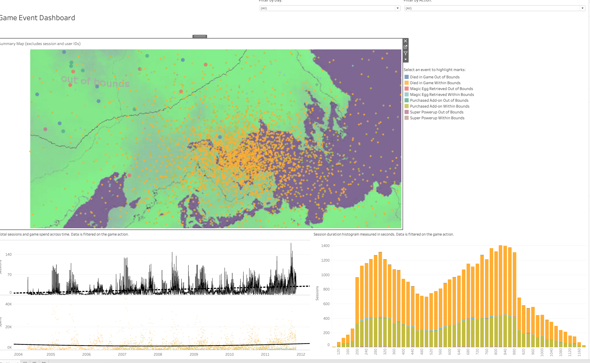

# Tableau Data Analysis Showcase

This repository contains various Tableau workbooks that demonstrate my ability to analyze and visualize data across different domains. Below is an overview of each Tableau file included in the repository.

## Contents

1. **Apple Hardware R&D Composition Costs Analysis**
   - **File**: [Apple hardware R&D composition costs.twbx](./Apple%20hardware%20R&D%20composition%20costs.twbx)
   - **Description**: This Tableau workbook analyzes the composition of R&D costs in Apple's hardware development process. It provides insights into how costs are distributed across different hardware components, helping stakeholders make informed decisions on resource allocation.

2. **Executive Overview Monitoring Case Data**
   - **File**: [Executive Overview Monitoring Case Data.twbx](./Executive%20Overview%20Monitoring%20Case%20Data.twbx)
   - **Description**: This dashboard provides an executive-level overview of case data, highlighting key performance indicators (KPIs) such as case resolution times, priorities, and agent performance. It is designed for quick, data-driven decision-making at the leadership level.

3. **Game Player Portrait Analysis**
   - **File**: [Game player portrait analysis.twbx](./Game%20player%20portrait%20analysis.twbx)
   - **Description**: This analysis provides insights into the characteristics of game players, breaking down metrics such as player demographics, in-game behavior, and purchasing patterns. It enables game developers to understand their audience better and refine their strategies.

4. **Improving the Efficiency of the R&D Team**
   - **File**: [Improve the efficiency of the R&D team.twbx](./Improve%20the%20efficiency%20of%20the%20R&D%20team.twbx)
   - **Description**: This workbook focuses on analyzing the efficiency of an R&D team by evaluating their workflow, identifying bottlenecks, and suggesting strategies for improving productivity. It visualizes key metrics such as project timelines, team performance, and resource utilization.

5. **Manage R&D Team Workload Analysis**
   - **File**: [Manage R&D team workload analysis.twbx](./Manage%20R&D%20team%20workload%20analysis.twbx)
   - **Description**: This Tableau dashboard helps in managing and balancing the workload of R&D teams by identifying project overloads and underutilization. It assists in optimizing resource distribution and aligning team capabilities with project requirements.

6. **Product Development and Bug Management Analysis**
   - **File**: [Product development and bug management analysis.twbx](./Product%20development%20and%20bug%20management%20analysis.twbx)
   - **Description**: This analysis provides insights into the product development lifecycle and the management of bugs. It includes metrics such as bug resolution times, priority levels, and the impact of bugs on the development process.

7. **Product Development Life Cycle Analysis**
   - **File**: [Product Development Life Cycle Analysis.twbx](./Product%20Development%20Life%20Cycle%20Analysis.twbx)
   - **Description**: This Tableau workbook visualizes the various stages of the product development life cycle. It helps in monitoring project progress, resource allocation, and key milestones to ensure that projects stay on track and within budget.

## Usage

1. Clone or download the repository to access the Tableau workbooks.
2. Open the `.twbx` files in Tableau Desktop to explore the visualizations and interactive dashboards.
3. Feel free to modify the workbooks or use them as templates for your own data analysis.

## Requirements

- Tableau Desktop (any version that supports `.twbx` files)
- Data access may vary depending on the context of the analysis. Please ensure that your data sources are appropriately configured if you intend to connect your own data.

## Contact

For any questions or collaborations, feel free to reach out to me at [Your Email Address].
